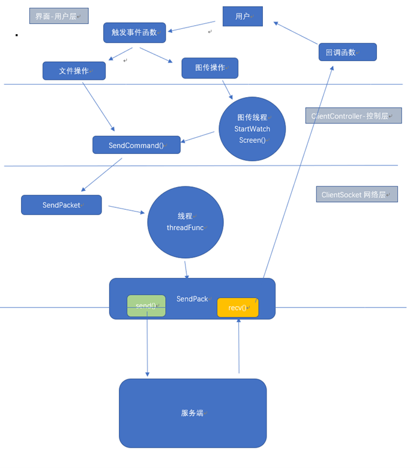
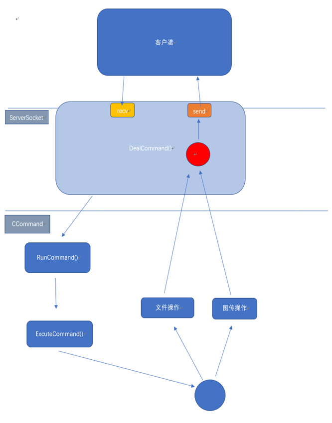

# MFC远控项目

## 编译环境

1、 编译工具：vs2022

2、 编译语言：C/C++

3、 操作系统：Windows11

4、 辅助工具：git，StarUML

5、 网络协议：TCP/IP

6、 初步设计模式：客户端-服务端（C/S）模式

7、 后期设计模式：一对多模式、客户端mvc架构

## 被控端（server）

1、 初始化网络环境 WSAStartup()

2、 创建服务端套接字 socket()

3、 初始化服务端信息 sockaddr_in 结构体

4、 绑定套接字 bind()

5、 监听listen()

6、 连接accept()

7、 收发数据 recv send()

8、 数据处理 

## 控制端（client）

1、 初始化网络环境

2、 创建客户端套接字socket()

3、 初始化客户端网络信息 sockaddr_in结构体

4、 连接服务端 connect()

5、 接收发数据 recv() send()

6、 数据处理

## 数据包设计

### 数据包的结构

````c++
	WORD sHead;				//固定位FEFF
	DWORD nLength;			//包长度：控制命令 到 校验 结束
	WORD sCmd;				//控制命令
	std::string strData;	//包数据
	WORD sSum;				//和校验
	std::string strOut; 	//整包数据
````

### 数据包的解包封包

````c++
/**
 * 数据包的解包构造函数
 * 
 * @param pData 指向数据包的指针
 * @param nSize 数据包的字节大小（输入时为数据总长度，返回时为已解析的长度）
 */
CPacket(const BYTE* pData, size_t& nSize) : sHead(0), nLength(0), sCmd(0), sSum(0) {
    size_t i = 0; // 数据解析游标
    // 1. 查找包头标志 0xFEFF
    for (; i < nSize; i++) {
        if (*(WORD*)(pData + i) == 0xFEFF) { // 校验包头
            sHead = *(WORD*)(pData + i); // 记录包头
            i += 2; // 包头占用 2 字节，游标向后移动
            break;
        }
    }
    // 如果剩余数据不足以解析固定长度的字段（length + cmd + sum）
    if (i + 8 > nSize) { 
        nSize = 0; // 标记为解析失败
        return;    // 数据包大小不足
    }
    // 2. 解析长度字段 nLength（4 字节）
    nLength = *(DWORD*)(pData + i);
    i += 4;
    // 如果包长度不完整（剩余数据不足）
    if (nLength + i > nSize) { 
        nSize = 0; // 标记为解析失败
        return;
    }
    // 3. 解析命令字 sCmd（2 字节）
    sCmd = *(WORD*)(pData + i);
    i += 2;
    // 4. 解析数据段（长度为 nLength - 4，去掉 cmd 和 sum 的长度）
    if (nLength > 4) {
        strData.resize(nLength - 4); // 分配数据段大小
        memcpy((void*)strData.c_str(), pData + i, nLength - 4); // 复制数据段
        i += nLength - 4;
    }
    // 5. 解析校验和 sSum（2 字节）
    sSum = *(WORD*)(pData + i);
    i += 2;
    // 6. 计算数据段校验和
    WORD sum = 0; 
    for (size_t j = 0; j < strData.size(); j++) {
        sum += (BYTE(strData[j]) & 0xFF); // 累加每个字节的低 8 位
    }
    // 7. 校验和验证
    if (sum == sSum) { // 如果校验和匹配
        nSize = i; // 更新 nSize 为已解析的数据长度
        return;    // 解析成功
    }
    nSize = 0; // 校验失败，标记解析失败
}

//--------------------------------------------------------------\\

/**
 * 数据包的封包构造函数
 * 
 * @param nCmd  命令字，表示包的类型或功能
 * @param pData 数据段的指针，指向需要封装的内容
 * @param nSize 数据段的大小（字节数）
 */
CPacket(WORD nCmd, const BYTE* pData, size_t nSize) {
    // 1. 初始化包头
    sHead = 0xFEFF; // 固定包头标志
    // 2. 计算并设置数据包的总长度
    nLength = nSize + 4; // 总长度 = 数据段长度 + 命令字段长度 (2 字节) + 校验和字段长度 (2 字节)
    // 3. 设置命令字
    sCmd = nCmd;
    // 4. 处理数据段
    if (nSize > 0) {
        strData.resize(nSize); // 分配数据段的存储空间
        memcpy((void*)strData.c_str(), pData, nSize); // 将数据复制到数据段
    } else {
        strData.clear(); // 如果没有数据，清空数据段
    }
    // 5. 计算校验和
    sSum = 0; // 初始化校验和
    for (size_t j = 0; j < strData.size(); j++) {
        sSum += (BYTE(strData[j]) & 0xFF); // 累加每个字节的低 8 位
    }
}

````

## 两端数据包的发送和接收模块

### 控制发起端（客户端）



------

#### 发送模块：

**1· 点击控件触发事件函数** 

**2· 向消息处理线程 `PostThreadMessage`**

````cpp
BOOL CClientSocket::SendPacket(HWND hWnd, const CPacket& pack, WPARAM wParam) 
{
	// 序列化数据包内容为字符串形式存储到 strOut 中
	std::string strOut;
	pack.Data(strOut);
    
	// 动态分配一个 PACKET_DATA 对象，用于包装数据包内容和附加信息
	// 构造时传入数据内容、数据长度、模式标志和用户参数
	PACKET_DATA* pData = new PACKET_DATA(strOut.c_str(), strOut.size(), nMode, wParam);
	// 将消息发送到指定线程的消息队列，使用 WM_SEND_PACK 消息
	// m_nThreadID 是目标线程的 ID，pData 是消息的附加数据，hWnd 是处理结果的接收者
	BOOL ret = PostThreadMessage(m_nThreadID, WM_SEND_PACK, (WPARAM)pData, (LPARAM)hWnd);

	// 如果消息发送失败，删除动态分配的 PACKET_DATA 避免内存泄漏
	if(ret == FALSE) delete pData;

	// 返回发送结果
	return ret;
}
````

**3· 数据包被消息处理线程函数捕获 `::GetMessage(&msg, NULL, 0, 0)`**

**处理自定义消息 `WM_SEND_MESSAGE` 调用了真正发送数据包的函数 `SendPack`**

> ***关于回包的处理:***
>
> ​	***将回包发送到对应发送数据的窗体（通过窗口句柄），MFC的消息机制会自动调用窗口上与自定义消息绑定的函数来处理回包***

````cpp
/**
 * 发送数据包并接收服务器的响应
 *
 * @param nMsg  消息类型（此处未使用）
 * @param wParam 包含发送数据的指针（PACKET_DATA 结构体）
 * @param lParam 接收响应的窗口句柄·用在将消息发送到对应的窗口 (HWND) 
 */
void CClientSocket::SendPack(UINT nMsg, WPARAM wParam, LPARAM lParam) {
    // 1. 解析数据结构
    PACKET_DATA data = *(PACKET_DATA*)wParam; // 提取数据包信息
    delete (PACKET_DATA*)wParam; // 释放动态内存

    HWND hWnd = (HWND)lParam; // 获取目标窗口句柄 用于接收到回包，将回包通过消息机制发送到指定窗体
    CPacket current((BYTE*)data.strData.c_str(), data.strData.size()); // 封装数据为数据包对象

    // 2. 初始化套接字
    if (initSocket() == TRUE) 
    {
        // 3. <<-----------------发送数据包---------------->>
        if (send(m_sock, (char*)data.strData.c_str(), (int)data.strData.size(), 0) > 0) 
        {
            // 4. 循环接收数据包
            std::string strBuffer(BUFFER_SIZE, '\0'); // 创建接收缓冲区
            size_t index = 0; // 当前接收数据的索引

            while (m_sock != INVALID_SOCKET) { // 套接字有效时继续接收
                int length = recv(m_sock, &strBuffer[index], BUFFER_SIZE - index, 0);
                if (length > 0 || index > 0) { // 收到数据或存在未处理的残留数据
                    index += length; // 更新有效数据索引
                    CPacket pack((BYTE*)strBuffer.data(), index); // 尝试解析数据包
                    
//-------------回包的处理·将回包通过SendMessage(handle,...)发送到对应的窗体来处理-------\\
                    if (index > 0) { // 成功解析数据包
                        // 发送消息通知目标窗口，表示数据包已成功解析
                        ::SendMessage(
                            hWnd, 
                            WM_SEND_PACK_ACK, 
                            (WPARAM)new CPacket(pack),
                            data.wParam
                        );
                        // 处理剩余未解析的数据
                        index = 0; // 重置索引
                    }
                } else { // 未收到数据或发生网络异常
                    CloseSocket(); // 关闭套接字
                    // 通知接收窗口发生异常
                    ::SendMessage(
                        hWnd, 
                        WM_SEND_PACK_ACK, 
                        (WPARAM)new CPacket(current.sCmd, NULL, 0), 
                        1
                    );
                    break; // 跳出循环
                }
            }
        } else { // 数据发送失败
            CloseSocket(); // 关闭套接字
            // 通知窗口发生网络错误
            ::SendMessage(hWnd, WM_SEND_PACK_ACK, NULL, -1);
        }
    } else {
        // 套接字初始化失败，通知窗口错误
        ::SendMessage(hWnd, WM_SEND_PACK_ACK, NULL, -2);
    }
}

````

**4·回包的处理(以下载文件为例子)**

````cpp
SendCommandPacket(m_remoteDlg, 4);
````

`m_remoteDlg` 作为要处理回包的窗口句柄

该窗体捕捉到发送来的消息，处理对应操作

------

**5.接收模块：**

````cpp
// 在主窗口中注册的回包处理函数
ON_MESSAGE(WM_SEND_PACK_ACK, &CRemoteClientDlg::OnSendPacketAck)
    
LRESULT CRemoteClientDlg::OnSendPacketAck(WPARAM wParam, LPARAM lParam) 
{
    if (wParam != NULL) {
        CPacket head = *(CPacket*)wParam; // 从消息拿到包的地址，提取并复制给一个临时对象
        delete (CPacket*)wParam; // 防止内存泄漏释放指针
        DealCommand(head.sCmd,head.strData,lParam); // 开始解析包
    }
    return 0;
}

// 解析包的函数 DealCommand 如下：
void CRemoteClientDlg::DealCommand(WORD nCmd, const std::string& strData, LPARAM lParam) {
	switch (nCmd) {
	// ... 其他的指令操作
	case 4://下载文件
           // 每次收到一个文件下载的回包 都会被调用一次 但是通过了一个局部静态变量来让函数执行不同的操作
		UpdateDownloadFile(strData, (FILE*)lParam); // 具体实现参考文件下载模块
		break;
	}
    // ... 其他的指令操作
}
    
// 屏幕监控窗口中注册的回包处理函数
ON_MESSAGE(WM_SEND_PACK_ACK, &CWatchDialog::OnSendPacketAck)
    
````

------

### 受控端（服务端）



先接收来自客户端的命令，处理完成命令后，通过拿到的命令执行对应映射关系的函数，将要发送的包存储到回包列表中，执行完回调函数后才进行回包的统一发送


## 功能设计

### 1、 驱动盘符遍历

````c++
//server
if(_chdrive(i) == 0){
	// 如果驱动器有效，将对应字母追加到结果字符串
	result += 'A' + i - 1; // 例如，i = 3 时，'A' + 2 = 'C'
}
````


### 2、 文件遍历

````c++
//server
int MakeDirectoryInfo(std::list<CPacket>& lstPacket, CPacket& inPacket) {
    // 切换目录
    _chdir(inPacket.strData.c_str());
    // 查找当前目录中的第一个文件
    _finddata_t fdata;
    int hfind = _findfirst("*", &fdata);
    // 遍历当前目录中的文件和子目录
    do {
        // 构造文件信息
        bool isDirectory = ((fdata.attrib & _A_SUBDIR) != 0);
        // ... (将文件信息填入 CPacket 并添加到 lstPacket)
    } while (!_findnext(hfind, &fdata));
    // 关闭查找句柄
    _findclose(hfind);

    return 0; // 成功
}

````


### 3、 文件删除

````c++
// 拿到控制端发来的路径strPath
//...    
// 尝试删除指定路径的文件
BOOL bRet = DeleteFileA(strPath.c_str());
// 向包列表中添加删除操作的结果
lstPacket.push_back(CPacket(9, NULL, 0));
````


### 4、 文件下载

客户端讲要下载的文件的路径通过数据包的形式发送给服务器，服务器解析到下载指令后执行：

#### 服务/受控 端上传文件操作

````cpp
int DownloadFile(std::list<CPacket>& lstPacket, CPacket& inPacket) {
    std::string strPath = inPacket.strData;
    FILE* pFile = nullptr;

    // 打开文件以读取
    errno_t err = fopen_s(&pFile, strPath.c_str(), "rb");
    long long data = 0;

    // 如果文件打开失败
    if (err != 0) {
        // 返回文件大小为 0
        lstPacket.push_back(CPacket(4, (BYTE*)&data, sizeof(long long)));   
        return -1;
    }

    if (pFile != nullptr) {
        // 获取文件大小
        fseek(pFile, 0, SEEK_END);// 通过fseek设置文件中的索引偏移到末尾拿到文件大小
        data = _ftelli64(pFile);
        // 先将文件大小做成一个包发送 如果大小为0就是打开和读取时出了问题
        lstPacket.push_back(CPacket(4, (BYTE*)&data, sizeof(long long)));
        fseek(pFile, 0, SEEK_SET);
		//下面是分包发送文件的函数
        char buffer[1024] = "";
        size_t rlen = 0;
        do {
            // 读取文件数据 大小1024
            rlen = fread(buffer, 1, sizeof(buffer), pFile);
            lstPacket.push_back(CPacket(4, (BYTE*)buffer, rlen));
        } while (rlen == sizeof(buffer)); // 继续读取直到文件结束
		//当读取到的大小不为缓冲区大小是 说明到末尾 就不再进行循环
        fclose(pFile); // 关闭文件
    } else {
        // 如果文件指针为空
        lstPacket.push_back(CPacket(4, NULL, 0));
    }

    return 0; // 成功返回
}

````

#### 客户/控制 端接收下载操作

````cpp
void CRemoteClientDlg::UpdateDownloadFile(const std::string& strData, FILE* pFile) {
    // 这个局部静态变量是多次调用该函数下载一个文件的关键
    static LONGLONG length = 0, index = 0; // 文件总长度和已写入长度

    if (length == 0) { 
        // 第一个包：获取文件总长度
        length = *(LONGLONG*)strData.c_str();
        if (length == 0) { 
            // 文件长度为 0 或无法读取，结束下载
            CClientController::getInstance()->DownloadEnd();
            return;
        }
    } 
    else if (index >= length) { 
        // 文件下载完成
        fclose(pFile); // 关闭文件
        length = index = 0; // 重置状态
        CClientController::getInstance()->DownloadEnd();
    } 
    else { 
        // 写入文件数据
        fwrite(strData.c_str(), 1, strData.size(), pFile);
        index += strData.size(); // 更新已写入长度

        if (index >= length) { 
            // 文件写入完成
            fclose(pFile);
            length = index = 0; // 重置状态
            CClientController::getInstance()->DownloadEnd();
        }
    }
}
````


### 5、 图传操作/屏幕监控

**1.控制端开启线程发起请求**

````cpp
void CClientController::StartWatchScreen() {
    // 设置标志位，表示线程未关闭
    m_isClosed = FALSE;

    // 启动后台线程，用于监控远程屏幕
    // 将当前类实例 `this` 作为参数传递给线程
    m_hThreadWatch = (HANDLE)_beginthread(
        &CClientController::threadWatchScreen, // 线程函数指针
        0,                                    // 默认堆栈大小
        this                                  // 传递给线程的参数
    );

    // 显示监控对话框，进入模态状态
    m_watchDlg.DoModal();

    // 在对话框关闭后设置标志位，通知线程结束
    m_isClosed = TRUE;

    // 等待后台线程结束，超时时间为 500 毫秒
    WaitForSingleObject(m_hThreadWatch, 500);
}
````

````c++
void CClientController::threadWatchScreen() {
    // 延时启动，确保线程运行时相关资源已初始化
    Sleep(50);
    // 用于记录上一次发送命令的时间戳（毫秒）
    ULONGLONG nTick = GetTickCount64();
    
    // 主线程循环：持续监控屏幕，直到 `m_isClosed` 被置为 true
    while (!m_isClosed) {
        // 检查是否可以缓存新的图片
        if (!m_watchDlg.isFull()) { 
            // 当前时间与上次发送命令的间隔不足 200ms 时，主动等待
            if (GetTickCount64() - nTick < 200) {
                Sleep(200 - (DWORD)(GetTickCount64() - nTick)); // 补足等待时间
            }
            // 更新时间戳为当前时间
            nTick = GetTickCount64();
            // 发送请求图片的命令数据包，指令类型为 6
            int ret = SendCommandPacket(
                m_watchDlg.GetSafeHwnd(), // 窗口句柄，指向对话框 `m_watchDlg`
                6,                        // 指令代码 6：请求屏幕图片
                true,                     // 表示是否需要响应
                NULL,                     // 数据指针，此处为空表示无附加数据
                0                         // 数据长度为 0
            );
        } else {
            // 如果缓存已满，则短暂休眠 1 毫秒以避免 CPU 占用过高
            Sleep(1);
        }
    }
}
````

**2.被控端操作：**

````html
屏幕设备上下文 (HDC) 获取
        ↓
屏幕分辨率 & 像素位数获取
        ↓
CImage 初始化并保存屏幕内容
        ↓
内存流创建并写入 PNG 数据
        ↓
封装为 CPacket 并存储
        ↓
释放资源，清理内存

````

**3.控制端操作：**

**`watchDlg` 中有和自定义消息绑定函数，将接收到的回包发送到 `watchDlg`  窗体来处理**

````cpp
LRESULT CWatchDialog::OnSendPacketAck(WPARAM wParam, LPARAM lParam) {
    // 检查 lParam 是否有效，略去非关键逻辑
    if (lParam > 0) { 
        CPacket* pPack = (CPacket*)wParam; // 接收到的数据包
        if (pPack != NULL) { 
            CPacket head = *(CPacket*)wParam; // 提取数据包头部信息
            delete (CPacket*)wParam;         // 释放动态分配的内存
   //<<---------------------------------------------------------->>
            switch (head.sCmd) { 
            case 6: // 指令 6：处理图片更新逻辑
                // 1. 将字节流转换为图像对象
                CEdoyunTool::Byte2Image(m_image, head.strData);
                // 2. 获取图片控件的显示区域大小
                CRect rect;
                m_picture.GetWindowRect(rect);
                // 3. 更新图像对象的宽高信息
                m_nObjWidth = m_image.GetWidth();
                m_nObjHeight = m_image.GetHeight();
                // 4. 将图像绘制到控件上（缩放适配控件大小）
                m_image.StretchBlt(
                    m_picture.GetDC()->GetSafeHdc(), // 控件的设备上下文
                    0, 0,                           // 目标区域的起点坐标
                    rect.Width(), rect.Height(),    // 目标区域的宽高
                    SRCCOPY                         // 绘制模式
                );
                // 5. 触发控件重绘以显示新图像
                m_picture.InvalidateRect(NULL);
                // 6. 销毁图像资源以释放内存
                m_image.Destroy();


            }
        }
    }
    return 0; // 返回消息处理结果
}

````


### 6、 鼠标操作

````cpp
// 控制端和被控端都定义了该结构体来传输和接收鼠标操作信息
typedef struct MouseEvent {
	MouseEvent() {
		nAction = 0;
		nButton = -1;
		ptXY.x = 0;
		ptXY.y = 0;
	}

	WORD nAction;	//点击 移动 双击
	WORD nButton;	//左键右键中键
	POINT ptXY;		//坐标
}MOUSEEV, * PMOUSEEV;

//控制端发送信息 被控端拿到并解析出信息 再调用系统操控鼠标的api
````


### 7、 锁屏(线程)

````c++
/**
 * 锁机功能 - 全屏窗口覆盖和限制用户操作
 */
void threadLockDlgMain() {
    dlg.Create(IDD_DIALOG_INFO, NULL);

    // 全屏覆盖窗口
    CRect rect;
    rect.right = GetSystemMetrics(SM_CXSCREEN); 
    rect.bottom = GetSystemMetrics(SM_CYSCREEN);
    dlg.MoveWindow(rect);
    dlg.SetWindowPos(&dlg.wndTopMost, 0, 0, 0, 0, SWP_NOSIZE | SWP_NOMOVE);

    // 隐藏光标和任务栏
    ShowCursor(FALSE);
    ::ShowWindow(::FindWindow(_T("Shell_TrayWnd"), NULL), SW_HIDE);

    // 消息循环，监控按键退出条件
    MSG msg;
    while (GetMessage(&msg, NULL, 0, 0)) {
        if (msg.message == WM_KEYDOWN && msg.wParam == 0x41) // 按 'A' 键退出
            break;
        TranslateMessage(&msg);
		DispatchMessage(&msg);
    }

    // 恢复光标和任务栏
    ShowCursor(TRUE);
    ::ShowWindow(::FindWindow(_T("Shell_TrayWnd"), NULL), SW_SHOW);

    dlg.DestroyWindow();
}

````

**核心流程**

1. 创建全屏窗口 → 置顶 → 屏蔽任务栏。
2. 限制鼠标范围，隐藏光标。
3. 进入消息循环，拦截并处理用户输入。
4. 按指定条件（如按键事件）退出并恢复环境。

> [!NOTE]
>
> 在解锁时 采用：
>
> ::PostThreadMessage(threadId, WM_KEYDOWN, 0x41, 0);
>
> threadId 为控制锁屏的线程


### 8、 管理员启动

关于管理员启动用了如下办法：

#### 判断是否以管理员身份运行

> Windows 提供了权限控制机制，可以通过检查当前进程的令牌（token）是否具有提升权限（elevated privilege）来判断是否以管理员身份运行

#### 以管理员身份运行程序

> 当程序不是以管理员身份运行时，可以重新启动当前程序，并以管理员权限运行。这里使用了 `CreateProcessWithLogonW` 函数


### 9、 开机自启

- 修改注册表 `"SOFTWARE\Microsoft\Windows\CurrentVersion\Run";`
- 添加文件到自启动文件夹 `"C:\Users\op\AppData\Roaming\Microsoft\Windows\Start Menu\Programs\Startup\"`


# WINDOWS消息机制

> Windows 消息机制是 Windows 操作系统中一个核心的事件驱动模型，允许应用程序响应用户输入和系统事件

## 一、底层实现

**消息队列**：

- 每个线程都有一个消息队列（Message Queue），用于存储该线程接收到的消息。
- 操作系统负责管理消息队列，将消息放入队列中。

**消息结构**：

- 消息通过 `MSG` 结构体表示，结构体中包含消息类型、窗口句柄、消息参数等信息：

````cpp
typedef struct tagMSG {
    HWND   hwnd;       // 消息的目标窗口句柄
    UINT   message;    // 消息的类型
    WPARAM wParam;     // 附加消息参数
    LPARAM lParam;     // 附加消息参数
    DWORD  time;       // 消息的时间戳
    POINT  pt;         // 消息发生时的光标位置
} MSG, *PMSG;

````

**消息循环**：

- 应用程序通常会运行一个消息循环，使用 `GetMessage` 函数从消息队列中检索消息，直到收到退出消息：

````cpp
MSG msg;
while (GetMessage(&msg, NULL, 0, 0)) {
    TranslateMessage(&msg);  // 翻译虚拟键消息
    DispatchMessage(&msg);    // 派发消息到窗口过程
}

````

**消息发送**：

- 消息可以通过  SendMessage 或 PostMessage

   函数发送到指定窗口。区别在于：

  - `SendMessage` 是同步调用，发送后会等待目标窗口处理完毕；
  - `PostMessage` 是异步调用，将消息放入目标窗口的消息队列中，立即返回。

------

# UDP内网穿透


# IOCP

**I/O 完成端口 (IOCP)** 是 Windows 提供的一种高效异步 I/O 机制，广泛用于高性能网络服务和多线程任务处理。它允许线程在处理完成的 I/O 操作时获得通知，从而避免繁琐的轮询操作

## IOCP的基本使用

**1.投递任务**：

- 调用异步 API（如 `ReadFile` 或 `WSARecv`）发起操作，内核将操作挂起到设备驱动。
- 任务进入 IOCP 队列，等待完成。

**2.完成通知**：

- 操作完成后，驱动程序通知内核，内核将完成信息放入 IOCP 队列。

**3.线程获取任务**：

- 线程通过 `GetQueuedCompletionStatus` 从队列中提取完成的任务。

**4.负载均衡**：

- IOCP 支持动态分配线程处理任务，避免线程竞争，最大化 CPU 利用率。

## IOCP如何结合线程池使用


## IOCP实现的线程安全队列

**IOCP 的核心原理**：

- `PostQueuedCompletionStatus` 用于将任务投递到完成端口。
- `GetQueuedCompletionStatus` 从完成端口中取出任务并处理。

**线程间通信与同步**：

- 利用 IOCP 实现线程间任务分发，避免显式的加锁。
- 通过事件 (`HANDLE`) 同步任务执行和通知主线程。

**任务调度模型**：

- 主线程投递任务，后台线程处理。
- IOCP 自动管理任务队列，确保线程安全。


# 异步I/O

## 重叠结构